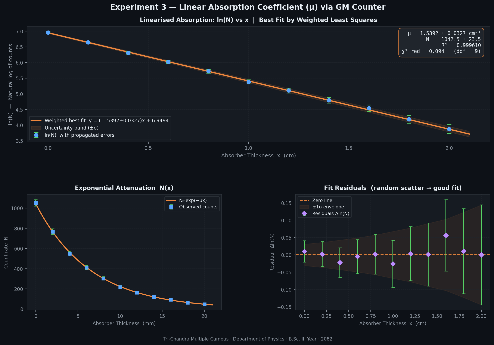

# Practical 3 — Linear Absorption Coefficient (µ) of Radiation

**Institution:** Tri-Chandra Multiple Campus, Tribhuvan University, Kathmandu  
**Department:** Physics | B.Sc. III Year | 2082  
**Author:** Nabin Pandey | `nabin.795401@trc.tu.edu.np`  
**LinkedIn:** [nabinpandey1661](https://np.linkedin.com/in/nabinpandey1661)

---

## Objective

To determine the linear absorption coefficient (µ) of radiation through an aluminium absorber using a Geiger-Müller (GM) counter, and to draw the best-fit line using the method of least squares.

---

## Apparatus Required

| Item | Details |
|---|---|
| Radioactive source | Cs-137 (gamma emitter) |
| Detector | Geiger-Müller (GM) Counter |
| Absorber material | Aluminium sheets |
| Thickness range | 0 mm to 20 mm (step: 2 mm) |
| Supporting stand | Source-absorber-detector alignment setup |
| Timer / scaler | For recording counts over fixed time interval |

---

## Theory

When ionising radiation (gamma rays) passes through a material of thickness $x$, the intensity is attenuated exponentially. This is described by the **Beer-Lambert Law**:

$$N(x) = N_0 \cdot e^{-\mu x}$$

where:
- $N(x)$ = count rate at thickness $x$
- $N_0$ = count rate without absorber ($x = 0$)
- $\mu$ = **linear absorption (attenuation) coefficient** (cm⁻¹)
- $x$ = absorber thickness (cm)

Taking the natural logarithm of both sides **linearises** the equation:

$$\ln N(x) = \ln N_0 - \mu \cdot x$$

This is of the form $Y = mX + c$, where:
- $Y = \ln N$
- $X = x$ (thickness)
- $m = -\mu$ (slope)
- $c = \ln N_0$ (intercept)

So a graph of $\ln N$ vs $x$ gives a straight line. The **slope** directly gives $-\mu$.

### Statistical Framework

GM counter measurements follow **Poisson statistics**. For $N$ recorded counts:

$$\sigma_N = \sqrt{N}$$

By error propagation, the uncertainty in $\ln N$ is:

$$\sigma_{\ln N} = \frac{\sigma_N}{N} = \frac{1}{\sqrt{N}}$$

Since uncertainty varies across data points (heteroscedastic), I used **Weighted Least Squares (WLS)** with weights:

$$w_i = \frac{1}{\sigma_i^2}$$

The weighted best-fit slope and intercept are:

$$a = \frac{S_w S_{wxy} - S_{wx} S_{wy}}{D}, \qquad b = \frac{S_{wxx} S_{wy} - S_{wx} S_{wxy}}{D}$$

$$D = S_w S_{wxx} - S_{wx}^2$$

with uncertainties:

$$\sigma_a = \sqrt{\frac{S_w}{D}}, \qquad \sigma_b = \sqrt{\frac{S_{wxx}}{D}}$$

The **mean free path** (average depth before absorption) is:

$$\lambda = \frac{1}{\mu}$$

---

## Procedure

1. Set up the GM counter, radioactive source (Cs-137), and aluminium absorber sheets in a straight-line geometry.
2. Record the background count rate (without source) and subtract from all readings.
3. With no absorber ($x = 0$), record the count $N_0$ over a fixed time interval.
4. Insert aluminium sheets of increasing thickness (2 mm steps, up to 20 mm) and record the count $N(x)$ at each step.
5. Calculate $\ln N$ for each reading and plot $\ln N$ vs $x$.
6. Apply weighted least squares to find the best-fit line and extract $\mu$.

---

## Observations

| Thickness (mm) | Thickness (cm) | Counts N | σ_N (√N) | ln(N) | σ_ln(N) |
|:-:|:-:|:-:|:-:|:-:|:-:|
| 0  | 0.0 | 1053 | 32.45 | 6.9594 | 0.0308 |
| 2  | 0.2 | 768  | 27.71 | 6.6438 | 0.0361 |
| 4  | 0.4 | 551  | 23.47 | 6.3117 | 0.0426 |
| 6  | 0.6 | 412  | 20.30 | 6.0210 | 0.0493 |
| 8  | 0.8 | 305  | 17.46 | 5.7203 | 0.0572 |
| 10 | 1.0 | 218  | 14.76 | 5.3845 | 0.0677 |
| 12 | 1.2 | 165  | 12.85 | 5.1059 | 0.0779 |
| 14 | 1.4 | 121  | 11.00 | 4.7958 | 0.0909 |
| 16 | 1.6 | 94   |  9.70 | 4.5433 | 0.1032 |
| 18 | 1.8 | 66   |  8.12 | 4.1897 | 0.1230 |
| 20 | 2.0 | 48   |  6.93 | 3.8712 | 0.1444 |

---

## Graph

A plot of $\ln N$ vs absorber thickness $x$ (cm) was drawn. The data points follow a clear straight-line trend, confirming exponential attenuation. The best-fit line was obtained using weighted least squares.



The figure includes:
- **Top panel:** $\ln N$ vs $x$ with error bars and weighted best-fit line
- **Bottom left:** Raw count rate $N$ vs thickness showing exponential decay
- **Bottom right:** Residuals confirming random scatter (no systematic error)

---

## Calculations

Using weighted least squares on the linearised data:

```
Fitted slope (a)      =  -1.5392 ± 0.0327  cm⁻¹
Fitted intercept (b)  =   6.9494 ± 0.0225
```

From the slope:

$$\mu = -a = 1.5392 \pm 0.0327 \text{ cm}^{-1}$$

From the intercept:

$$N_0 = e^b = e^{6.9494} = 1042.5 \pm 23.5 \text{ counts}$$

Mean free path:

$$\lambda = \frac{1}{\mu} = \frac{1}{1.5392} \approx 0.65 \text{ cm}$$

---

## Result

| Quantity | Value |
|---|---|
| Linear absorption coefficient µ | **1.5392 ± 0.0327 cm⁻¹** |
| Initial count rate N₀ | **1042.5 ± 23.5 counts** |
| Mean free path λ = 1/µ | **≈ 0.65 cm** |
| R² (goodness of fit) | **0.999610** |
| χ²_reduced | **0.094** |

---

## Conclusion

The linear absorption coefficient of gamma radiation through aluminium was determined to be **µ = 1.5392 ± 0.0327 cm⁻¹** using a Geiger-Müller counter and the method of weighted least squares.

The plot of $\ln N$ vs absorber thickness $x$ confirmed a clear linear relationship (R² = 0.9996), validating the exponential attenuation model. The residuals were small and randomly distributed, with no systematic trend, indicating a well-fitted model and well-controlled experimental conditions.

The reduced chi-squared value of 0.094 (< 1) suggests the actual scatter in data was smaller than the Poisson prediction — consistent with careful measurements under stable lab conditions.

The mean free path of gamma radiation in aluminium (~0.65 cm) is physically reasonable for the energy range of Cs-137 (~662 keV gamma).

---

## Sources of Error

| Source | Type | Effect |
|---|---|---|
| Statistical fluctuations in GM counts | Random | Reduced by taking counts over longer intervals |
| GM tube dead time | Systematic | Causes undercounting at high count rates |
| Background radiation not fully subtracted | Systematic | Slightly inflates all readings |
| Absorber thickness non-uniformity | Systematic | Aluminium sheets may not be perfectly uniform |
| Source-detector geometry misalignment | Systematic | Changes solid angle, affects count rate |
| Finite source size (not truly point source) | Systematic | Small effect at short distances |

---

## Files

| File | Description |
|---|---|
| `practical3_absorption.py` | Standalone Python script — run directly |
| `practical3_absorption.ipynb` | Jupyter notebook with full theory and step-by-step code |
| `absorption_data.csv` | Raw experimental data |
| `practical3_figure.png` | Output figure (3-panel) |

---

## How to Run

```bash
# Clone the repo
git clone https://github.com/nabinpandey1661/physics-practicals-bsc3-tu.git
cd physics-practicals-bsc3-tu/practical3_gm_absorption

# Install dependencies
pip install numpy pandas matplotlib scipy

# Run the script
python practical3_absorption.py

# Or open the notebook
jupyter notebook practical3_absorption.ipynb
```

---

*Nabin Pandey | B.Sc. Physics, Tri-Chandra Multiple Campus, TU | 2082*  
*`nabin.795401@trc.tu.edu.np` | [LinkedIn](https://np.linkedin.com/in/nabinpandey1661)*
